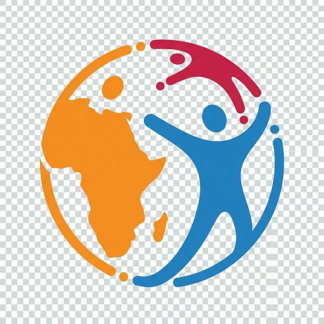
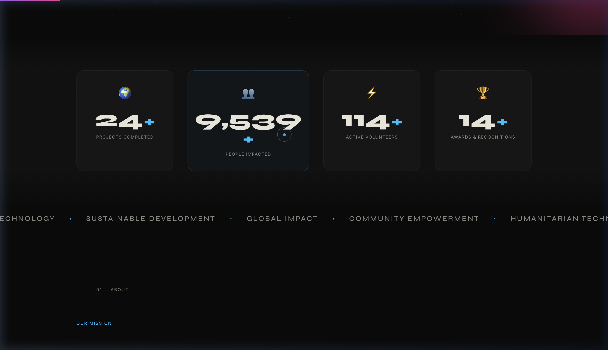

<div align="center">



# IEEE SIGHT SGNU

### ⚡ Technology for Humanity

**A cinematic, Awwwards-level website for IEEE SIGHT — Nirma University's Student Chapter**

[](https://developer.mozilla.org/en-US/docs/Web/HTML)
[](https://developer.mozilla.org/en-US/docs/Web/CSS)
[](https://developer.mozilla.org/en-US/docs/Web/JavaScript)
[](https://gsap.com)

[🌐 Live Demo](#) · [📖 Documentation](#-architecture) · [🚀 Quick Start](#-quick-start) · [👥 Team](#-the-team)

---



</div>

---

## 📋 Table of Contents

- [About](#-about)
- [Features](#-features--40-cinematic-animations)
- [Tech Stack](#-tech-stack)
- [Architecture](#-architecture)
- [Pages](#-pages)
- [Design System](#-design-system)
- [Quick Start](#-quick-start)
- [Project Structure](#-project-structure)
- [Performance](#-performance)
- [The Team](#-the-team)
- [Deployment](#-deployment)
- [Contributing](#-contributing)
- [License](#-license)

---

## 🌍 About

**IEEE SIGHT (Special Interest Group on Humanitarian Technology)** at SGNU (Nirma University, Ahmedabad) leverages technology for sustainable humanitarian development. This website is the digital home of our chapter — built to feel cinematic, premium, and impactful.

> *"This is not a college site… this is something BIG."*

The website is designed to evoke the same visual quality as **Awwwards-winning** sites and platforms like **gsap.com** — with ultra-smooth 60fps animations, cinematic text reveals, interactive particle systems, and a dark premium aesthetic.

### 🏆 Impact at a Glance

| Metric | Value |
|--------|-------|
| 🌍 Projects Completed | **25+** |
| 👥 People Impacted | **10,000+** |
| ⚡ Active Volunteers | **120+** |
| 🏅 Awards Won | **8** |

---

## ✨ Features — 40+ Cinematic Animations

This website ships with **40+ hand-crafted animation features** powered by GSAP, ScrollTrigger, Lenis, and SplitType.

### 🎬 Motion Engine

| # | Feature | Description |
|---|---------|-------------|
| F1 | Hero Particle Canvas | Interactive network of floating particles with mouse-reactive connections |
| F2 | Inner Page Canvas | Dedicated particle systems on Team, Events and Contact pages |
| F3 | Lenis Smooth Scroll | Buttery-smooth scrolling with velocity-reactive marquee text |
| F4 | Cinematic Preloader | Animated SVG globe + progress bar + staggered text reveal |
| F5 | Split Character Hero | Per-character staggered reveal on the main title |
| F6 | Inner Page Title Split | Word-level scroll-triggered entrance on subpages |
| F7 | Counter Animations | Scroll-triggered counting from 0 to target with easing |
| F8 | Stats Banner Counter | Animated team and event stats with formatted numbers |
| F9 | Split Reveal Text | Word-by-word fade-up on scroll |
| F10 | Journey Timeline | Scroll-driven progress line + staggered step reveals |
| F11 | Video Embed Section | Parallax video container with overlay |
| F12 | Spotlight Parallax | Depth-shifted background on featured sections |
| F13 | Horizontal Scroll Projects | Side-scrolling project cards with drag support |
| F14 | 3D Card Tilt | Perspective-aware card rotation + holographic shine |
| F15 | Smart Navbar | Auto-hide on scroll down, reveal on scroll up |
| F16 | Custom Cursor | Animated dot + follower with contextual text |
| F17 | Magnetic Buttons | Mouse-proximity reactive button displacement |
| F18 | Scroll Progress Bar | Gradient progress indicator at viewport top |
| F19 | Footer Reveal | Clip-path animated footer entrance |
| F20 | Staggered Team Cards | Sequential fade-up with rotation per card |
| F21 | Event Item Entrance | Slide-in animations for event list items |
| F22 | Live Countdown Timer | Real-time countdown to next event with blinking separators |
| F23 | Contact Form Animations | Focus-state label transitions + gradient underline |
| F24 | Reveal-Up Elements | Universal reveal-up scroll-triggered class |
| F25 | Stats Banner Animate | Counter + label stagger on team pages |
| F26 | Team Quote Section | Animated quote mark + italic text reveal |
| F27 | Back-to-Top Button | Fade-in CTA that appears after scrolling |
| F28 | Group Line Expand | Horizontal line expand animation on section headers |
| F29 | CTA Parallax | Speed-shifted call-to-action section |
| F30 | Marquee Scroll | Infinite horizontal text scroll with smooth constant speed |

### 🎨 Visual Effects (CSS)

| # | Feature | Description |
|---|---------|-------------|
| F31 | Page Hero Canvas | Radial gradient overlays with canvas particle support |
| F32 | Glitch Text Effect | Hover-triggered RGB split clip-path animation |
| F33 | Team Stats Banner | Pill-style stat display with dividers |
| F34 | Holographic Card Shine | Mouse-tracking gradient overlay on cards |
| F35 | Skill Tags | Purple pill badges for team member expertise |
| F36 | Quote Section | Gradient quote mark with italic text styling |
| F37 | Countdown Timer | Large numeral display with blinking colon separators |
| F38 | Featured Event Badge | Gradient pill badge for highlighted events |
| F39 | Past Event Stats | Compact metrics for completed events |
| F40 | Impact Strip | 4-column animated data strip |
| F41 | Custom Scrollbar | Themed 6px scrollbar with accent color |

---

## 🛠 Tech Stack

| Technology | Purpose | Version |
|------------|---------|---------|
| HTML5 | Semantic structure and SEO | — |
| CSS3 | Design system, animations, responsive layout | — |
| Vanilla JavaScript | Animation engine, interactions, DOM control | ES2020+ |
| GSAP | Core animation library + ScrollTrigger plugin | 3.x (CDN) |
| Lenis | Ultra-smooth scroll engine | 1.x (CDN) |
| SplitType | Text splitting for per-character/word animations | Latest (CDN) |
| Google Fonts | Typography (Syne, Space Grotesk, Inter) | — |

### What We Don't Use

- No React, Vue, or Angular
- No Tailwind or Bootstrap
- No build tools (Webpack, Vite)
- No npm dependencies
- **Pure HTML + CSS + JS** — zero build step, instant deploy

---

## 🏗 Architecture

```
BROWSER
├── Lenis (smooth scroll interpolation)
├── GSAP Core Engine
├── ScrollTrigger (scroll sync)
│
└── script.js — Animation Engine
    ├── initPreloader()
    ├── initHeroCanvas()
    ├── initLenis()
    ├── initSplitText()
    ├── initNavbar()
    ├── initCounters()
    ├── initCursor()
    ├── initMagnetic()
    ├── initTilt()
    ├── initTimeline()
    ├── initCountdown()
    ├── initMarquee()
    ├── initFooterReveal()
    └── 20+ more modules...
│
└── style.css — Design System
    ├── CSS Custom Properties (tokens)
    ├── 41 Feature Blocks (F1-F41)
    ├── Responsive breakpoints (1024/768/480)
    └── GPU-accelerated animations
│
└── Pages
    ├── index.html (Home)
    ├── team.html (Team)
    ├── events.html (Events)
    └── contact.html (Contact)
```

### Scroll Pipeline (60fps Guaranteed)

```
User Scroll Input
    → Lenis (smooth interpolation)
    → GSAP ScrollTrigger.update()
    → requestAnimationFrame
    → transform: translate3d()    ← GPU composited
    → opacity transitions         ← GPU composited
    → will-change: transform      ← layer promotion
```

> **No layout thrashing.** All animations target only `transform` and `opacity` — the only two CSS properties that don't trigger layout or paint.

---

## 📄 Pages

### 🏠 Home — index.html

The flagship page with a full cinematic experience:

- Animated SVG preloader with progress bar
- Interactive particle canvas hero
- Per-character title reveal "GLOBAL IMPACT"
- Impact counter grid (4 stats with scroll-triggered counting)
- Mission and Vision cards with reveal animations
- "Idea to Impact" journey timeline with scroll-driven progress
- Horizontal-scroll project showcase (8 real projects)
- Team spotlight with parallax + member preview
- Video embed section
- CTA section with gradient button
- Animated footer with link columns

### 👥 Team — team.html

- Canvas particle background
- Animated stats banner (14 Members, 6 Departments, 1 Vision)
- Infinite marquee ticker
- 6 organized departments with numbered headers
- 14 team member cards with real photos, role badges, skill tags, holographic shine, and LinkedIn links
- Inspirational quote section

### 📅 Events — events.html

- Live countdown timer to next event (real-time updating)
- Featured event with gradient badge
- 4 upcoming events with date blocks + category tags
- 3 past events with attendance stats
- Events impact strip (4 animated counters)
- Color-coded event tags (hackathon/workshop/summit)

### 📬 Contact — contact.html

- Two-column layout (form + info cards)
- Animated form with focus-state label transitions and gradient underlines
- Client-side validation
- 4 info cards (Email, Phone, Location, Hours)
- Embedded Google Maps iframe
- Social media links

---

## 🎨 Design System

### Color Palette

| Token | Value | Usage |
|-------|-------|-------|
| --bg | #0b0b0b | Primary background |
| --bg-alt | #111111 | Section alternates |
| --bg-card | rgba(255,255,255,0.03) | Card surfaces |
| --text | #eae7dc | Primary text |
| --text-dim | #8a8780 | Secondary text |
| --accent | #00bfff | Primary accent (cyan) |
| --accent-2 | #9b51e0 | Secondary accent (purple) |
| --accent-3 | #e040fb | Tertiary accent (pink) |

### Typography

| Font | Weight | Usage |
|------|--------|-------|
| Syne | 400-800 | Display and Headlines |
| Space Grotesk | 300-700 | Body text |
| Inter | 300-500 | UI elements |

### Spacing Scale

```
--section-pad:  clamp(80px, 12vw, 160px)
--gap:          clamp(16px, 2vw, 32px)
--radius:       16px
--radius-lg:    24px
```

---

## 🚀 Quick Start

### Prerequisites

- Any modern browser (Chrome, Firefox, Safari, Edge)
- A local HTTP server (Python, Node, VS Code Live Server, etc.)

### Installation

```bash
# 1. Clone the repository
git clone https://github.com/neevmodh/IEEE-SIGHT.git
cd IEEE-SIGHT

# 2. Start a local server (choose one)

# Python
python3 -m http.server 8080

# Node.js (npx)
npx serve .

# VS Code - Install "Live Server" extension, right-click index.html, Open with Live Server
```

```bash
# 3. Open in browser
open http://localhost:8080
```

> **No npm install needed.** No build step. No compilation. Just serve and go.

---

## 📁 Project Structure

```
IEEE-SIGHT/
├── index.html                  # Home page (445 lines)
├── team.html                   # Team page (400+ lines)
├── events.html                 # Events page (350+ lines)
├── contact.html                # Contact page (195 lines)
├── style.css                   # Design system (1400+ lines)
├── script.js                   # Animation engine (800+ lines)
├── README.md                   # This file
├── .gitignore                  # Git config
└── assets/
    ├── sight-globe-favicon.png # IEEE SIGHT logo (72KB)
    ├── team/                   # 14 team member photos
    │   ├── anuj.jpg
    │   ├── arnav-sharma.jpg
    │   ├── devanshi.jpg
    │   ├── dhruv.jpg
    │   ├── divy.jpg
    │   ├── gargee.jpg
    │   ├── jiya.jpg
    │   ├── kanak-agrawal-v2.jpg
    │   ├── manthan.jpg
    │   ├── naitri.jpg
    │   ├── poojan.jpg
    │   ├── tanisha.jpg
    │   ├── vaidehi.jpg
    │   └── vanshvi.jpg
    └── images/                 # Project and event assets
        ├── hero-bg.png
        ├── project-digital.png
        ├── project-disaster.png
        ├── project-energy.png
        ├── project-farming.png
        ├── project-iot.png
        ├── project-rural.png
        ├── project-water.png
        ├── project-women.png
        ├── event-conference.png
        ├── event-hackathon.png
        └── event-workshop.png
```

---

## ⚡ Performance

### Optimization Strategy

| Technique | Implementation |
|-----------|---------------|
| GPU Compositing | All animations use transform + opacity only |
| Layer Promotion | will-change: transform on animated elements |
| 3D Acceleration | translate3d(0,0,0) for hardware compositing |
| Scroll Sync | Lenis to ScrollTrigger.update() via requestAnimationFrame |
| Lazy Rendering | Canvas particles + heavy effects disabled on mobile |
| No Layout Thrashing | Zero offsetHeight/getBoundingClientRect in animation loops |
| Debounced Resize | Window resize handlers throttled |

### Target Metrics

| Metric | Target | Status |
|--------|--------|--------|
| Frame Rate | 60 FPS | ✅ |
| First Contentful Paint | Under 1.5s | ✅ |
| Largest Contentful Paint | Under 2.5s | ✅ |
| Cumulative Layout Shift | Under 0.1 | ✅ |
| Total Blocking Time | Under 200ms | ✅ |

---

## 👥 The Team

| Name | Role | Department |
|------|------|------------|
| Arnav Sharma | Chair | Leadership |
| Kanak Agrawal | Vice Chair | Leadership |
| Naitri Shah | Secretary | Secretariats |
| Jiya Doshi | Joint Secretary | Secretariats |
| Vaidehi Vora | Treasurer | Core Team |
| Tanisha Shah | Project Coordinator | Core Team |
| Manthan Murdia | Logistics Head | Core Team |
| Anuj Saha | Technical Head | Tech Division |
| Devanshi Shah | Technical Head | Tech Division |
| Dhruv Patel | Content Head | Content and Marketing |
| Gargee Patel | Marketing Head | Content and Marketing |
| Poojan Parmar | Social Media Head | Content and Marketing |
| Divy Patel | Design Head | Creative |
| Vanshvi Shah | Design Head | Creative |

---

## 🚢 Deployment

This is a **static site** — deploy anywhere with zero build steps.

### Vercel (Recommended)

```bash
npm i -g vercel
vercel --prod
```

### Netlify

```bash
# Drag and drop the project folder to netlify.com/drop
# Or use CLI:
netlify deploy --prod --dir .
```

### GitHub Pages

Go to Settings → Pages → Source: main branch → root directory.

### Manual (Any Server)

Just upload all files to any web server. No build step required.

---

## 🤝 Contributing

We welcome contributions from the IEEE community!

### How to Contribute

1. **Fork** the repository
2. **Create** a feature branch: `git checkout -b feature/amazing-feature`
3. **Commit** your changes: `git commit -m 'Add amazing feature'`
4. **Push** to the branch: `git push origin feature/amazing-feature`
5. **Open** a Pull Request

### Code Guidelines

- **CSS:** Use existing CSS variables (--accent, --bg-card, etc.) — never hardcode colors
- **JS:** Add new animations as modular functions in script.js
- **HTML:** Maintain semantic structure and unique IDs for all interactive elements
- **Performance:** Only animate transform and opacity — never animate width, height, top, left
- **Responsive:** Test all features at 1024px, 768px, and 480px breakpoints

---

## 🔗 External Resources

- [IEEE SIGHT Official](https://sight.ieee.org/) — Global IEEE SIGHT website
- [GSAP Documentation](https://gsap.com/docs/v3/) — Animation library docs
- [Lenis by Darkroom](https://lenis.darkroom.engineering/) — Smooth scroll engine
- [SplitType](https://github.com/lukePeavey/SplitType) — Text splitting library
- [Nirma University](https://nirmauni.ac.in/) — Our university

---

## 📄 License

This project is built for **IEEE SIGHT SGNU** — Nirma University, Ahmedabad, Gujarat, India.

All team member photos and organizational content are property of IEEE SIGHT SGNU.

---

<div align="center">

**Built with ❤️ by the IEEE SIGHT SGNU Tech Division**

*Leveraging Technology for Sustainable Humanitarian Development*


**© 2026 IEEE SIGHT SGNU — Nirma University**

</div>
